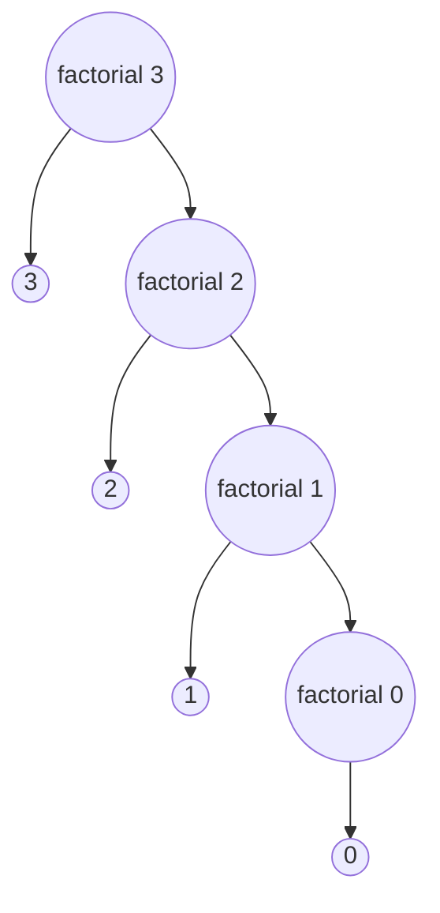

If a function calls itself inside the function body, then it is called a recursive function. There must be a condition inside the function body, so that the recursive call to itself can stop. Without the condition, there will be an infinite loop of function calls.

Recursion has two phases. One is Ascending and Descending phase.

1. In the function body, before calling itself, if there is a statement, that is run at function calling time. This is the ascending phase.
2. If any operation has to be done based on the return value of the function or any other operation has to be done after a function call has ended, that is done on the return time or the descending phase.

## Types of Recursion

1. Tail Recursion
2. Head Recursion
3. Tree Recursion
4. Indirect Recursion
5. Nested Recursion

### Tail Recursion

If a function calls itself, and the recursive call is the last statement of that function and no other operation is remaining, then it is called a tail recursion. Most of the time, loops are better than tail recursion.

### Head Recursion

If a function calls itself before any other statement, then it is a head recursion.

### Tree Recursion

If a function has more than one call to itself then it is called a tree recursion.

### Indirect Recursion

If two or more functions call each other an create a cycle, then it is a nested recursion. For example, `function a` calls `function b` and `function b` calls `function c` and ultimately `function c` calls `function a` then it is a nested recursion.


## Code Examples

### Find factorial of `n`

In the following examples, we have defined a function named `factorial`, which calculates the factorial of the argument passed into it. It is a recursive function because, based on a condition, the function calls itself.

- Java:

```java
public class Main {
	public static void main(String[] args) {
		System.out.println("Factorial of 10 is " + factorial(10));
		// Output: Factorial of 10 is 3628800
	}

	public static int factorial(int n) {
		if (n > 0) {
			return n * factorial(n - 1);
		}

		return 1;
	}
}
```

- JS

```javascript
const factorial = (n) => {
	if (n > 0) {
		return n * factorial(n - 1);
	}

	return 1;
}

console.log(`Factorial of 10 is ${factorial(10)}`);
// Output: Factorial of 10 is 3628800
```

- Python

```python
def factorial(n):
	if n > 0:
		return n * factorial(n - 1)

	return 1

num = 10
print("Factorial of ", num, " is ", factorial(num))
# Output: Factorial of 10 is 3628800
```

Trace of the `factorial` function when called with an argument of `3`:


### Find sum of  `0` to `n`

- Java:

```java
public class Main {
	public static void main(String[] args) {
		System.out.println("Sum of 0 to 10 is " + sum(10));
		// Output: Sum of 0 to 10 is 55
	}

	public static int sum(int n) {
		if (n > 0) {
			return n + sum(n - 1);
		}

		return 0;
	}
}
```

- JS:

```javascript
const sum = (n) => {
	if (n > 0) {
		return n + sum(n - 1);
	}

	return 0;
}

console.log(`Sum of 0 to 10 is ${sum(10)}`);
// Output: Sum of 0 to 10 is 55
```

- Python:

```python
def sum(n):
	if n > 0:
		return n * sum(n - 1)

	return 1

num = 10
print("Sum of 0 to ", num, " is ", sum(num))
# Output: Sum of 0 to 10 is 55
```