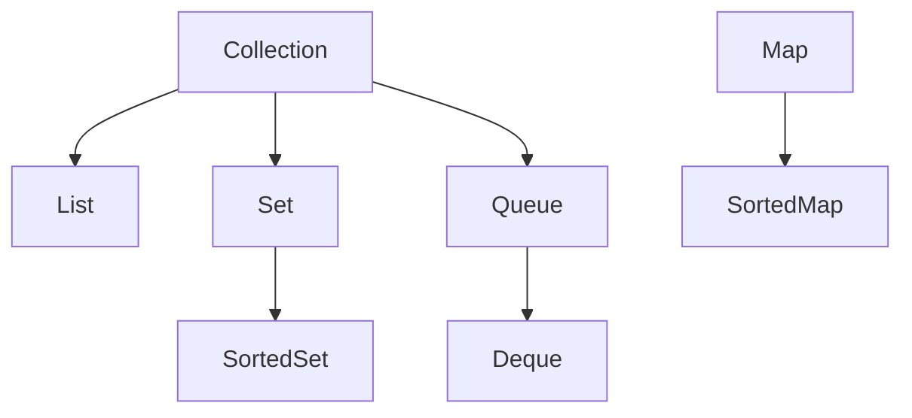

A collection in java represents a group of objects. These collections provide interfaces to perform on the group, such as Searching, Sorting. A collection contains 0 to many elements.

There are many different collections in Java. The top most interface of these collections are the Collection interface.



To define a collection we can use the `Collection` keyword along with the type of the elements in two angle brackets:

```java
// every item in this collection is of Student type
// and this collection is an ArrayList.
Collection<Student> students = new ArrayList<>()

// Or we can use the var keyword by mentioning the type
// after the ArrayList
var students = new ArrayList<Student>();
```

## Common collection operations

- `size()` -> get the number of elements
- `isEmpty()` -> check if the collection is empty
- `add()` -> add object to a collection
- `addAll()` -> adds all of the specified elements to the specified collection
- `remove()` -> removes an item from the collection
- `removeAll()` -> removes all specified elements from the specified collection
- `retainAll()` -> removes all elements which are not specified in the argument
- `contains()` -> checks if an element is a member of the collection
- `containsAll()` -> checks if all specified elements are members of the specified collection
- `clear()` -> removes all elements from the collection

```java
var stud1 = new Student("John Doe", 20);  
var stud2 = new Student("Jane Doe", 10);  
var stud3 = new Student("Jane Smith", 2);  
var stud4 = new Student("Jhon Smith", 22);  
  
Collection<Student> students = new ArrayList<>();  
Collection<Student> otherStudents = new ArrayList<>();  
  
students.add(stud1);  
students.add(stud2);  
  
otherStudents.add(stud3);  
otherStudents.add(stud4);  
  
System.out.println(students.toString());  
System.out.println(otherStudents.toString());  
  
System.out.println(students.size());  
System.out.println(students.isEmpty());  
  
System.out.println(students.contains(stud3));  
System.out.println(students.containsAll(otherStudents));
```

## Looping over the collections

We can use `for`, `for-each` and `while` loops to loop over the collections. We need to keep in mind that for `while` and `for` loops, need to use the `Iterator` to create an iterator.

```java
var stud1 = new Student("John Doe", 20);  
var stud2 = new Student("Jane Doe", 10);  
var stud3 = new Student("Jane Smith", 2);  
var stud4 = new Student("Jhon Smith", 22);  
  
Collection<Student> students = new ArrayList<>();  
  
students.add(stud1);  
students.add(stud2);
students.add(stud3);  
students.add(stud4);

// while  
while (iterator.hasNext()) {  
	Student student = iterator.next();  
	System.out.println(student);
	// We have toString override to show the following output
	// Student{name='John Doe', roll=20}
	// Student{name='Jane Doe', roll=10}
	// Student{name='Jane Smith', roll=2}
	// Student{name='Jhon Smith', roll=22}
}

// for
for (Iterator<Student> iterator = students.iterator(); iterator.hasNext();) {  
	Student student = iterator.next();  
	System.out.println(student);
	// We have toString override to show the following output
	// Student{name='John Doe', roll=20}
	// Student{name='Jane Doe', roll=10}
	// Student{name='Jane Smith', roll=2}
	// Student{name='Jhon Smith', roll=22}
}

// for-each
for (Student student: students) {  
	System.out.println(student);
	// We have toString override to show the following output
	// Student{name='John Doe', roll=20}
	// Student{name='Jane Doe', roll=10}
	// Student{name='Jane Smith', roll=2}
	// Student{name='Jhon Smith', roll=22}
}
```