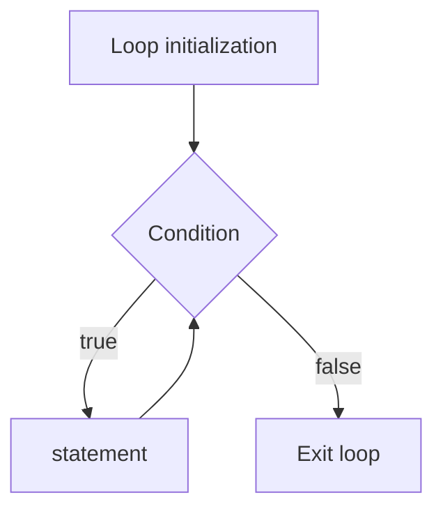

Looping lets us execute one or more statements or functions repeatedly based on some condition.

There are three parts to a loop. An `initialization`, `condition` to check, and `statement` to run if the `condition` is true.

## Initialization

In this phase, we create an initial variable which can be used inside the condition. 

## Condition

In this phase, we run some conditions. These conditions will either make the loop body run or cancel the loop.

## Statement

Statement(s) are lines of code which are run if the condition is true.