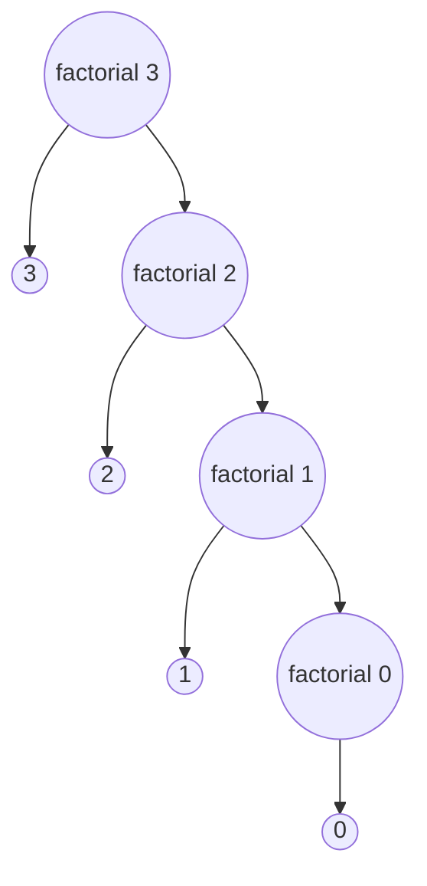

# What is a Factorial?

From wikipedia:

> In mathematics, the factorial of a non-negative integer $n$, denoted by $n!$, is the product of all positive integers less than or equal to $n$.

This means that the factorial of $n$ is the product of all positive integers from $1$ till $n$. So, the factorial of $5$ is,

$$5! = 5 \times 4 \times 3 \times 2 \times 1$$

Based on this we can say that the factorial of $n$ is,
$$n! = n \times {...} \times 2 \times 1$$
$$n! = n \times (n - 1) \times {...} \times 2 \times 1$$

If we look at the second equation and take the part $(n - 1) \times ... \times 2 \times 1$, we will get the factorial of $(n - 1)$. So we can say that, factorial of $n$ is the product of $n$ and $(n - 1)!$. So factorial of $n$ is,

$$n! = n \times (n - 1)!$$

# Implementation

In the following examples, we have defined a function named `factorial`, which calculates the factorial of the argument passed into it. It has a base condition where it checks if $n > 0$ and based on that, makes the recursive call.

### Java

```java
public class Main {
	public static void main(String[] args) {
		System.out.println("Factorial of 10 is " + factorial(10));
	}

	public static int factorial(int n) {
		if (n <= 0 || n == 1) {
			return 1;
		}

		return n * factorial(n - 1);
	}
}
```

**Output:**

```bash
Factorial of 10 is 3628800
```

### JavaScript

```javascript
const factorial = (n) => {
	if (n <= 0 || n == 1) {
		return 1;
	}

	return n * factorial(n - 1);
}

console.log(`Factorial of 10 is ${factorial(10)}`);
```

**Output:**

```bash
Factorial of 10 is 3628800
```

### Python

```python
def factorial(n):
	if n <= 0 || n == 1:
		return 1

	return n * factorial(n - 1)

num = 10
print("Factorial of ", num, " is ", factorial(num))
```

**Output:**

```bash
Factorial of 10 is 3628800
```

## Trace

Trace of the `factorial` function when called with an argument of `3`:

