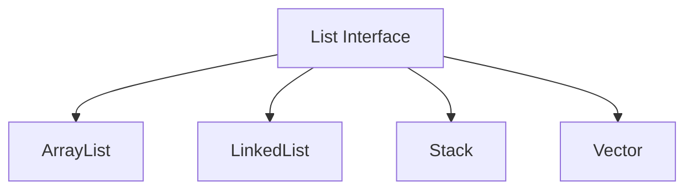

List interface is an ordered collection. This means that every item in the list is indexed like an array. This interface extends the Collection interface. There are four classes that implement the List interface.



## Key Methods

Lists inherit methods from the collection interface and modify them as needed. Here are some of the key methods:

1. `void add()` method has two different implementations:
	1. `add(int index, E e)` takes an `index` of type `int` as the first parameter and and `e` element of type `E`. The `index` defines where the element `e` will be added to and all the other elements after the `index` will be shifted to the right.
	2. `add(E e)` takes in one element `e` argument of type `E`. This adds the element `e`, as the very last item on the list.
2. `E remove(int index)` -> takes in one `index` argument of type `int` and removed the item in that `index` and returns it.
3. `E set(int index, E e)` -> takes in one `index` argument of type `int` and another element `e` argument of type `e`. This replaces the item in `index` with the element `e` and returns the replaced item.
4. `boolean addAll()` method has two different implementation:
	1. `addAll(Collection c)` -> takes in one collection `c` of type `Collection` and adds all the items from the `collection` to the end of the list.
	2. `addAll(int index, Collection c)` -> takes in one `index` of type `int` and one collection `c` of type `Collection`, then adds the items from the collection `c` to the specified `index` position. Everything after the `index` gets shifted to the right.
5. `int indexOf(Object o)` -> takes in one object `o` argument of type `Object` and returns the index of that object in the list. If there are more than one item which matches object `o` then the first items index will be returned.
6. `int lastIndexOf(Object o)` -> takes in one object `o` argument of type `object` and returns the last index of that object in the list.
7. `replaceAll(UnaryOperator<E> operator)` -> takes in a operator and runs that operator on each element of the collection and replaces the element with the result.

```java
private final List<Item> items = new ArrayList<>();

public void add(Item item, int index) {  
	// add(int index, E e)
	items.add(index, item);  
}

public void add(Item item) {  
	// add(E e)
	items.add(item);  
}

public boolean replaceAll(Item oldItem, Item newItem) {  
	boolean update = items.contains(oldItem);  
	  
	if (update) {
		// replaceAll(UnaryOperator<E> operator) - here we are using a lamdba
		items.replaceAll(item -> item == oldItem ? newItem : item);
	}  
	  
	return update;
}

public boolean replaceOne(Item oldItem, Item newItem, boolean isLast = false) {
	int position = -1;

	if (isLast) {
		// lastIndexOf(Object o)
		position = items.lastIndexOf(oldItem);
	} else {
		// indexOf(Object o)
		position = items.indexOf(oldItem);
	}

	if (position == -1)
		return false;

	// set(int index, E e)
	items.set(position, newItem);
	return true;
}
```