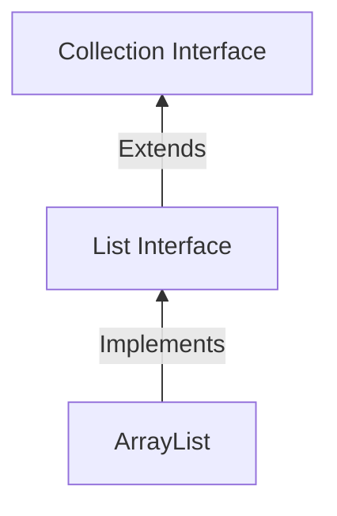

ArrayList is a class which implements the List interface of Java. This is an ordered list, which means that each element of the ArrayList collection is index.



There is a difference between Array and Array List in java. To declare a Array in java we have to mention the size of the array beforehand and that is also hard to increase. But for Array List we don't need to do that. The JDK increases the array size as needed.

## Creating an ArrayList

To create an ArrayList, we import `java.util.ArrayList` at the top of our file and then we can create an array list using `ArrayList<Type> list = new ArrayList<>()`. Here `Type` is the type of the items which will be stored inside the array list. We can use the `var` keyword to declare an ArrayList by using `var list = new ArrayList<Type>()`, but the `Type` will be defined inside the `<>` of `new ArrayList<>()`.

```java
// Import the ArrayList
import java.util.ArrayList;

class Main {
	public static void main(String[] args) {
		// Create an ArrayList
		ArrayList<Student> students = new ArrayList<>();
	}
}
```